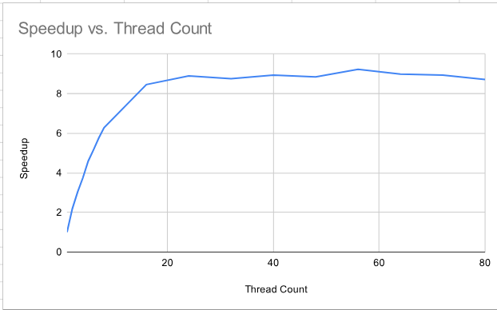

|Thread Count|Wall Clock Time|User Time|System Time|Speedup|
|:--:|--:|--:|--:|:--:|
|1|17.17|14.00| 0.80|1.00|
|2| 7.88|14.59| 0.57| 2.18|
|3| 5.66|15.19| 0.68| 3.03|
|4| 4.58|16.00| 0.77| 3.75|
|5| 3.74|15.83| 0.84| 4.59|
|6| 3.33|15.96| 1.12| 5.16|
|7| 2.98|16.22| 1.20| 5.76|
|8| 2.74|16.77| 1.09| 6.27|
|16| 2.03|17.95| 3.09| 8.46|
|24| 1.93|18.69| 6.48| 8.90|
|32| 1.96|18.07|11.23| 8.76|
|40| 1.92|17.42|19.76| 8.94|
|48| 1.94|17.21|20.30| 8.85|
|56| 1.86|16.84|36.24| 9.23|
|64| 1.91|16.95|26.08| 8.99|
|72| 1.92|16.60|30.34| 8.94|
|80| 1.97|17.22|20.84| 8.72|

**Question 1:**
At a certain number of threads used, the maximum speed-up seemingly plateaus off a bit. Assuming that I'm meant to answer this problem not knowing what Amdahl's Law is: the computer only has so much that it actually needs to process. At some point, in this case seemingly around 16 threads, adding more threads gives diminishing returns, as the extra data is not actually being processed faster anymore. The best analogy I can think of is that it's a bit like a reservoir, where at some point, overfilling it will simply spill out water. If you have an input of four items, then more than four threads is quote on quote "overfilling."

**Question 2:**
Unless you are explicitly trying to make the computer get "perfect scaling," in practice the program will almost certainly never run at perfectly the same speed.

**Question 3:**
Running timed with 16 cores, I got:

- main program 0.012088067 s

- results output 4.69e-07 s

- main program 1.907519767 s
  
indicating that

$$ serial = \frac{0.012}{1.907} = 0.006 $$

and thus

$$ speedup = \frac{1}{1 - 0.994 + \frac{0.994}{16}} = 14.679 $$

**Question 4:**
I got a slope equation of 0.75x + 0.5, however this is absolutely an approximation... my results didn't look very linear. Based on the graph above, this trend absolutely does not continue, for the reason discussed in question 1. Our thread count can get larger than the amount of data that actually needs to be processed, and if this happens, then the extra threads are not actually going to be taking in data and speeding up the runtime.
